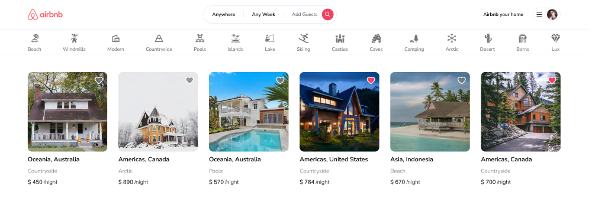

# Portfolio Blog - Nextjs v13.4.1

This is a practical **Airbnb** Clone crud [Next.js](https://nextjs.org/) project bootstrapped with [`create-next-app`](https://github.com/vercel/next.js/tree/canary/packages/create-next-app).

Explore the [demo](https://maxjn-airbnb-clone.vercel.app/) for better understanding'.

## Technologies

- TSX, Tailwindcss,
- TypeScript
- **Nextjs v13.4.1**
- **Main Packages:** mongodb, mongoose, next-auth, prisma ,redux-toolkit, react-reudux
- **Secondary Packages:** world-countries,react-select,leaflet,react-leaflet,@types/leaflet,bcrypt,
- **Routing:** useing new app directory

## Features

- Tailwind design
- Tailwind animations and effects
- Full responsiveness
- Credential authentication
- Google authentication
- Github authentication
- Image upload using Cloudinary CDN
- Client form validation and handling using react-hook-form
- Server error handling using react-toast
- Calendars with react-date-range
- Page loading state
- Page empty state
- Booking / Reservation system
- Guest reservation cancellation
- Owner reservation cancellation
- Creation and deletion of properties
- Pricing calculation
- Advanced search algorithm by category, date range, map location, number of guests, rooms and bathrooms
  - For example we will filter out properties that have a reservation in your desired date range to travel
- Favorites system
- Shareable URL filters
  -       Lets say you select a category, location and date range, you will be able to share URL with a logged out friend in another browser and they will see the same results
- How to write POST and DELETE routes in route handlers (app/api)
- How to fetch data in server react components by directly accessing database (WITHOUT API! like Magic!)
- How to handle files like error.tsx and loading.tsx which are new Next 13 templating files to unify loading and error handling
- How to handle relations between Server and Child components!

## Installation

###### Add Environment Variables

Create **.env.local** from '.env.example' file and declare the project environment variables

Starting a development instance of the app

###### shell command

```shell
npm install

npm run dev
```

## Screenshots


